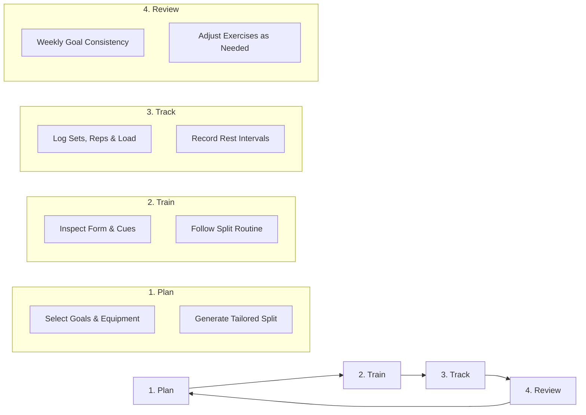

# Replyf

Replyf is a local-first web application for planning structured workouts, logging daily training sessions, and tracking long-term exercise progress.

This repository is the redesigned and expanded successor to my earlier project, [workout_planner](https://github.com/vikas0223/workout_planner). While the original project was a quick prototype to collect basic fitness preferences and output a static list of exercises, Replyf expands that concept into a complete training system with durable offline storage, exercise movement demonstrations, authentication, and progress logging.

> **Project History**: Earlier version available at [workout_planner](https://github.com/vikas0223/workout_planner).

---

## Why Replyf?

When I initially built Workout Planner, the goal was simple: provide an online form where someone could input their age, weight, and preferred workout duration to receive a basic training routine. It worked as a basic proof of concept, but it lacked the capabilities needed for actual day-to-day gym training:

- Workouts weren't saved persistently on the device; refreshing or leaving the page lost the plan.
- There was no support for logging sets, reps, or weights lifted during a session.
- Exercise guidance was text-only, without visual movement demonstrations or anatomical muscle targeting.
- The routine was static rather than structured into realistic training splits (like Push/Pull/Legs or Upper/Lower) based on specific gym equipment and weekly schedules.
- It required constant network access and couldn't function offline or install as a standalone mobile app.

Replyf was rebuilt from the ground up to solve those shortcomings. Instead of treating workout planning as a one-time form submission, Replyf organizes training around an ongoing local-first workflow: create a periodized plan, take it to the gym offline, log sets as they happen, and monitor volume over time.

---

## What It Does

Replyf provides a full training management workflow directly in the browser:

1. **Custom Plan Generation**: Generates customized multi-day workout splits based on primary goals (muscle growth, strength, fat loss, endurance), experience level, training location, available equipment, weekly days (2 to 6 days), and session duration.
2. **Local-First Reliability**: All user data—including onboarding answers, generated routines, and workout logs—is written immediately to local IndexedDB storage. The app works fully offline without requiring an account or network connection.
3. **Exercise Library with Media Fallbacks**: An internal catalog of exercises categorized by movement mechanics and target muscle groups. Includes visual movement demonstrations using original vector diagrams, generated looping motion GIFs, and photographic references.
4. **Interactive Workout Hub**: An active training dashboard where users can view daily sessions, check off exercises, track target sets and reps, adjust rest intervals, and record completion.
5. **Flexible Authentication & Migration**: Users can use Replyf anonymously in Guest Mode with zero friction. If they later choose to sign in or create an account via Supabase, their local guest workouts and history are automatically migrated to their cloud profile.
6. **Progressive Web App (PWA)**: Includes a Web App Manifest and service worker caching, allowing it to be installed directly to home screens on iOS and Android devices.

---

## What Changed From Workout Planner

The table below outlines the architectural and functional differences between the earlier `workout_planner` prototype and `Replyf`, based on the current codebase:

| Area | Earlier Workout Planner | Replyf |
| :--- | :--- | :--- |
| **Product Scope** | Single-page form that generated a basic static exercise routine. | Multi-route training platform with dedicated landing, wizard, workout hub, exercise library, dashboard, and analytics views. |
| **UI & Layout** | Simple forms with basic styling. | Modern UI built with Tailwind CSS, Radix UI primitives, Lucide icons, glassmorphism cards, and Framer Motion micro-interactions. |
| **Workout Planning** | Simple inputs (age, weight, duration) mapping to basic exercise recommendations. | 6-step wizard factoring in training goal, experience level, environment, specific equipment inventory, weekly split schedule, and session duration. |
| **Offline & Storage** | In-memory client state; refreshed data was lost. | Local-first architecture powered by IndexedDB (`indexeddb-engine.ts`) with five dedicated object stores and automatic sync queues. |
| **Authentication** | None; unauthenticated only. | Dual-factor access model supporting anonymous Guest Mode and remote Supabase authentication, with automated guest-to-account data migration. |
| **Exercise Guidance** | Basic text labels and descriptions. | Curated canonical catalog with primary/secondary anatomical muscle mappings, interactive SVG anatomy models, and multi-tier media fallbacks (SVGs, GIFs, photos). |
| **Session Logging** | No workout tracking or logging. | Active session logging, set completion recording, RPE tracking, rest interval timers, and weekly consistency metrics. |
| **PWA & Mobile** | Standard responsive webpage. | Installable Progressive Web App with standalone display mode, service worker asset caching, and native install prompt support. |
| **Testing & Quality** | Minimal automated tests. | Comprehensive Vitest test suite (75 test files, 650+ unit and integration tests) and automated browser verification scripts. |

---

## Core Features

- **Personalized Split Engine**: Algorithmic workout split assignment (Push/Pull/Legs, Upper/Lower, Full Body, Body-Part splits) balancing weekly muscle volume and recovery.
- **Equipment Filtering**: Tailors exercise selection specifically to available equipment (commercial gym machines, barbells, dumbbells, cables, resistance bands, or bodyweight).
- **Smooth Post-Step-6 Generation**: Dynamic plan generation screen with animated dual-arc progress indicator and a 6-stage verification checklist before rendering the final routine.
- **Anatomy & Muscle Mapping**: Visual anterior and posterior muscle group highlights indicating targeted primary and secondary muscle groups for each movement.
- **Full Offline Capabilities**: Offline reads and writes through a dedicated IndexedDB engine with schema versioning.
- **Smooth Scroll Landing Experience**: Polished product introduction page utilizing Lenis smooth scrolling and interactive plan preview widgets.
- **PWA Installation Banner**: Platform-aware install prompts supporting native Android `beforeinstallprompt` and iOS Safari "Add to Home Screen" instructions.

---

## Training Flow



1. **Plan**: Configure training parameters (goal, experience, schedule, equipment) through the 6-step onboarding wizard to build a structured routine.
2. **Train**: Open the Workout Hub to review daily sessions, review exercise movement cues and visual demonstrations, and work through assigned sets.
3. **Track**: Log completed sets, reps, and perceived exertion (RPE) in real time. All data saves locally to device storage immediately.
4. **Review**: Check weekly goal completion banners and review progress over time to stay consistent.

---

## Tech Stack

- **Framework**: [Next.js 15](https://nextjs.org/) (App Router, React 19)
- **Language**: [TypeScript](https://www.typescriptlang.org/) (Strict type-checking)
- **Styling**: [Tailwind CSS](https://tailwindcss.com/) with `tailwindcss-animate`
- **Component Primitives**: [Radix UI](https://www.radix-ui.com/) (Dialog, Accordion, Tooltip, Tabs, Dropdown Menu, Slider)
- **Icons**: [Lucide React](https://lucide.dev/)
- **Animations & Smooth Scroll**: [Framer Motion](https://www.framer.com/motion/) and [Lenis](https://github.com/darkroomengineering/lenis)
- **Local Persistence**: Zero-dependency pure TypeScript [IndexedDB Engine](lib/storage/indexeddb-engine.ts)
- **Remote Auth & Sync**: [@supabase/supabase-js](https://supabase.com/)
- **Data Validation**: [Zod](https://zod.dev/)
- **Charts & Data Visualization**: [Recharts](https://recharts.org/)
- **Testing**: [Vitest](https://vitest.dev/) with `@vitest/coverage-v8`
- **Asset Encoding**: [gifenc](https://github.com/mattdesl/gifenc) and [jpeg-js](https://github.com/eugeneware/jpeg-js) for local exercise GIF generation

---

## Architecture

Replyf employs a **local-first architecture**: client-side IndexedDB serves as the durable single source of truth for all application reads and writes.

```
┌─────────────────────────────────────────────────────────────┐
│                       Presentation                          │
│   (Next.js App Router, Radix UI Primitives, Tailwind CSS)   │
└──────────────────────────────┬──────────────────────────────┘
                               │
┌──────────────────────────────▼──────────────────────────────┐
│                    State & Context Layer                    │
│           (AuthGuardContext, WorkoutWizard, WorkoutHub)     │
└──────────────────────────────┬──────────────────────────────┘
                               │
┌──────────────────────────────▼──────────────────────────────┐
│                  Local-First Engine & IDB                   │
│   IndexedDBEngine (Stores: META, EXERCISES, WORKOUTS, LOGS) │
└──────────────┬──────────────────────────────▲───────────────┘
               │ (Mutations Enqueued)         │ (Background Pull)
┌──────────────▼──────────────┐ ┌─────────────┴───────────────┐
│         Sync Queue          │ │        Supabase Auth        │
│   (Offline Outbox Buffer)   │ │   (Remote Session & Cloud)  │
└─────────────────────────────┘ └─────────────────────────────┘
```

- **IndexedDB as Canonical State**: The UI reads and writes to local storage first. Even if the network disconnects or the user is in airplane mode, all workout data remains accessible and modifiable.
- **Outbox Sync Queue**: Mutations executed while offline are stored in a dedicated `SYNC_QUEUE` store to be resolved when connectivity resumes.
- **Dual-Factor Auth Guard**: The `AuthGuardContext` manages application state across initialization, guest mode, authenticated mode, and auth transitions without flashing incorrect layouts.

---

## Local-First & Offline

Replyf initializes an IndexedDB database named `workout_planner` with five core object stores:

- `META`: System metadata, access modes (`guest` vs `authenticated`), onboarding completion timestamps, and draft states.
- `EXERCISES`: Canonical exercise catalog containing movement patterns, equipment requirements, instructions, and anatomical tags.
- `GENERATED_WORKOUTS`: Stores active and historical workout plans tagged by owner (`guest` or user UUID).
- `WORKOUT_LOGS`: Session completion history, sets, reps, weights, and timestamps.
- `SYNC_QUEUE`: Queued outbox mutations awaiting remote synchronization.

A registered Service Worker (`public/sw.js`) caches static bundles, core stylesheets, icons, and exercise assets so the application can load and function completely disconnected from the internet.

---

## Exercise System & Media Resolution

Replyf avoids external API dependencies at runtime by maintaining an internal exercise catalog and a deterministic multi-tier media resolution system:

1. **Tier 1 (Original Vector SVGs)**: High-contrast, custom SVG vector demonstrations highlighting target muscle groups and movement vectors (`public/images/exercises/*.svg`).
2. **Tier 2 (Generated Looping GIFs)**: Reproducible two-frame movement GIFs encoded from public-domain photo frames (`public/videos/generated/*.gif`).
3. **Tier 3 (Photographic Demonstrations)**: High-resolution start and finish movement photographs (`public/exercises/{slug}/0.jpg`, `1.jpg`).
4. **Tier 4 (Anatomy Muscle Map)**: Interactive vector body silhouette highlighting anterior and posterior target muscles (`components/anatomy/muscle-map-model.tsx`).
5. **Tier 5 (Accessible Semantic Fallback)**: Styled equipment and movement category card.

A cryptographic asset manifest (`public/exercises/manifest.json`) tracks file hashes, dimensions, byte sizes, and provenance for all bundled exercise assets.

---

## Authentication & Guest Migration

Users are never forced to create an account to use Replyf:

- **Guest Mode**: Users can start training immediately. All workouts and logs are associated with an anonymous guest session and stored securely in local IndexedDB.
- **Authenticated Mode**: Users can log in using email/password or magic links via Supabase.
- **Automatic Migration**: When a guest user chooses to sign in or create an account, the `guest-migration.ts` engine inspects local storage, attaches existing workouts and session logs to the newly created user account, and synchronizes the records without losing training history.

---

## Project Structure

```
workout_planner/
├── app/                      # Next.js App Router pages and layouts
│   ├── analytics/            # Training analytics and volume tracking
│   ├── dashboard/            # Workout overview and weekly schedule
│   ├── exercises/            # Exercise catalog explorer and search
│   ├── landing/              # Marketing landing page with smooth scroll
│   ├── programs/             # Training programs and challenge tracks
│   ├── layout.tsx            # Global layout with theme and font providers
│   └── page.tsx              # Dynamic entry point governed by AuthGuard
├── components/               # UI components
│   ├── anatomy/              # Interactive SVG muscle and anatomy maps
│   ├── auth/                 # Auth screens, guest prompts, welcome transitions
│   ├── layout/               # Header, mobile drawer navigation, route guards
│   ├── pwa/                  # PWA install banners and update alerts
│   ├── ui/                   # Reusable Radix UI and Tailwind components
│   └── workout/              # Wizard questionnaire, hub, exercise cards
├── contexts/                 # React context providers (AuthGuardContext)
├── docs/                     # Architecture specifications, PRDs, and licenses
│   └── THIRD_PARTY_LICENSES.md
├── lib/                      # Business logic, engines, and utilities
│   ├── anatomy/              # Anatomy taxonomy and muscle group definitions
│   ├── data/                 # Canonical exercise catalog and dataset mappings
│   ├── engine/               # Workout plan generation engine
│   ├── media/                # Multi-tier exercise media resolver
│   ├── storage/              # IndexedDB database engine, schema, migration
│   └── supabase/             # Supabase browser and server clients
├── public/                   # Static assets, PWA manifest, service worker
│   ├── exercises/            # Bundled exercise photographs and manifest
│   ├── icons/                # PWA application icons
│   ├── images/               # In-house SVG exercise demonstrations
│   └── videos/               # Fallback movement GIFs and generated assets
├── scripts/                  # Verification suites and GIF generation tooling
└── tests/                    # Vitest unit, integration, and persistence tests
```

---

## Getting Started

### Prerequisites

- [Node.js](https://nodejs.org/) (v18.17.0 or higher recommended)
- [npm](https://www.npmjs.com/) (bundled with Node.js)

### Installation

1. Clone the repository:
   ```bash
   git clone https://github.com/vikas0223/Replyf.git
   cd Replyf/workout_planner
   ```

2. Install dependencies:
   ```bash
   npm install
   ```

3. Configure environment variables (optional):
   ```bash
   cp .env.example .env.local
   ```

4. Start the development server:
   ```bash
   npm run dev
   ```

5. Open [http://localhost:3000](http://localhost:3000) in your browser.

---

## Environment Variables

Replyf does not require any environment variables to run locally. If you wish to connect a remote Supabase instance for cloud authentication and database synchronization, configure the following variables:

| Variable | Required | Description |
| :--- | :--- | :--- |
| `NEXT_PUBLIC_SUPABASE_URL` | No | Your Supabase project URL (e.g., `https://xyz.supabase.co`). |
| `NEXT_PUBLIC_SUPABASE_ANON_KEY` | No | Your Supabase project anonymous public API key. |
| `SUPABASE_URL` | No | Server-side Supabase URL fallback. |
| `SUPABASE_SERVICE_ROLE_KEY` | No | Optional server-side service role key for administrative functions. |
| `NEXT_PUBLIC_ENABLE_TEST_HELPERS` | No | Set to `'true'` to expose deterministic test hooks in development. |

A template is provided in [.env.example](.env.example). Never commit real API keys or secrets to version control.

---

## Development & Verification

### Running the Dev Server

```bash
npm run dev
```

### Running Tests

The test suite covers the workout generation engine, anatomy definitions, guest migration, and IndexedDB persistence:

```bash
# Run all unit and integration tests
npm test

# Run tests in watch mode
npm run test:watch

# Generate a code coverage report
npm run test:coverage
```

### Type Checking & Linting

```bash
# Verify TypeScript types
npm run typecheck

# Run ESLint rules
npm run lint
```

### Production Build

```bash
npm run build
npm start
```

---

## Deployment

Replyf is optimized for deployment on [Vercel](https://vercel.com/) or any platform supporting Next.js 15 App Router:

1. Push your repository to GitHub.
2. Import the project into Vercel.
3. Configure the Root Directory to `workout_planner` (if deploying from a subdirectory) or project root.
4. If using Supabase, add `NEXT_PUBLIC_SUPABASE_URL` and `NEXT_PUBLIC_SUPABASE_ANON_KEY` to the Vercel project environment variables.
5. Deploy. The production build generates static pages and optimizes asset delivery automatically.

---

## Licensing

The repository's own software license has not yet been formally selected. All rights to the original application code are reserved by the author.

---

## Third-Party Licenses & Attributions

Replyf incorporates open-source libraries, public-domain dataset metadata, and vector assets. All external notices, license boundaries, and asset attributions are documented in detail in:

👉 **[docs/THIRD_PARTY_LICENSES.md](docs/THIRD_PARTY_LICENSES.md)**

Summary of key asset boundaries:
- **free-exercise-db**: Exercise metadata and photo frames dedicated to the Public Domain under The Unlicense.
- **Generated Exercise GIFs**: Loop animations created from public-domain image pairs using `gifenc`.
- **Third-Party Animated GIFs**: External dataset GIF references remain cataloged for reference only and are explicitly marked as `License/redistribution status: Unverified`.
- **Replyf In-House SVGs**: Original vector diagrams licensed under Creative Commons Attribution 4.0 International (CC-BY-4.0).
- **MuscleMap**: Vector silhouette coordinate geometries by Melih Colpan licensed under the MIT License.

---

## Project Status

Replyf is actively maintained as the primary evolution of the Workout Planner project. Features, exercise data, and offline sync capabilities continue to be refined.
